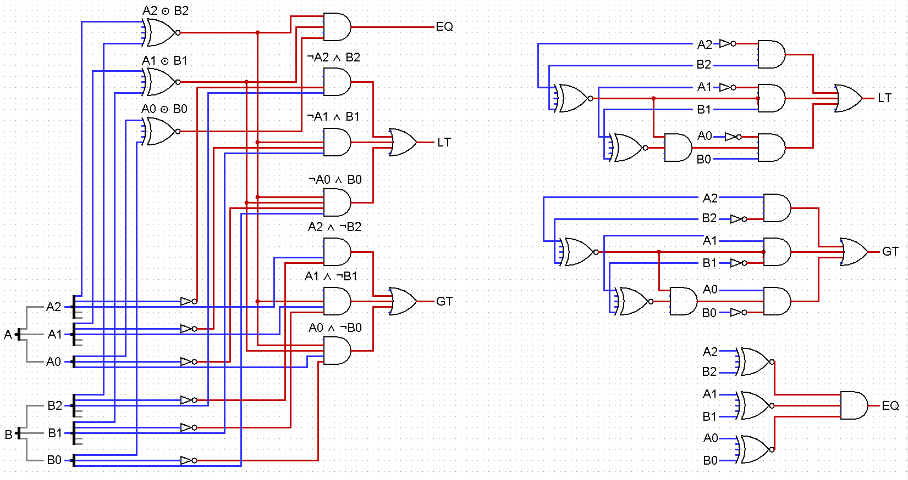

Compares A and B

EQ = (A2 ⊙ B2) ∧ (A1 ⊙ B1) ∧ (A0 ⊙ B0)
LT = (¬A2 ∧ B2) ∨ ((A2 ⊙ B2) ∧ ¬A1 ∧ B1) ∨ ((A2 ⊙ B2) ∧ (A1 ⊙ B1) ∧ ¬A0 ∧ B0)
GT = (A2 ∧ ¬B2) ∨ ((A2 ⊙ B2) ∧ A1 ∧ ¬B1) ∨ ((A2 ⊙ B2) ∧ (A1 ⊙ B1) ∧ A0 ∧ ¬B0)

